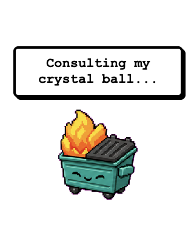
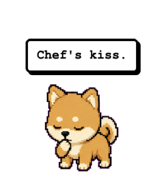
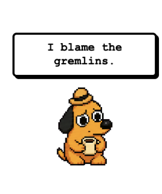
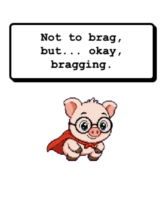
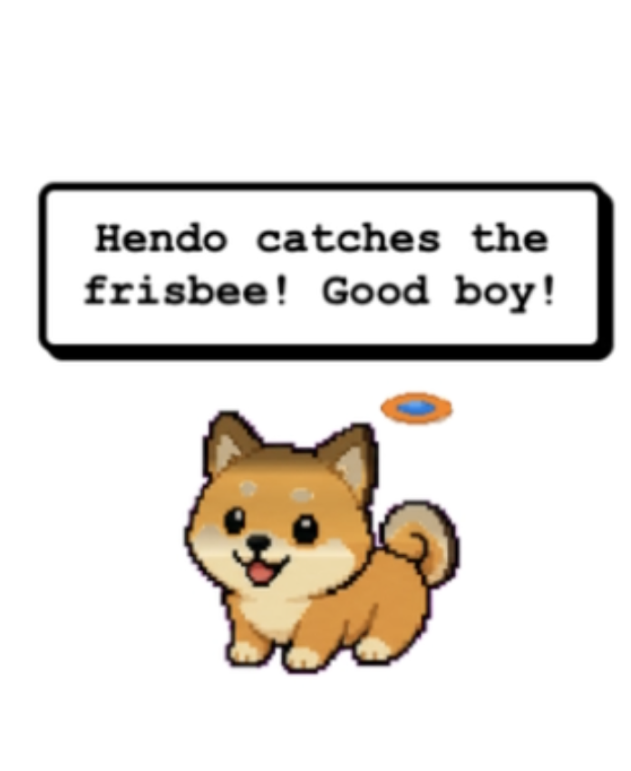
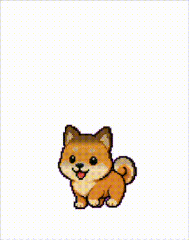
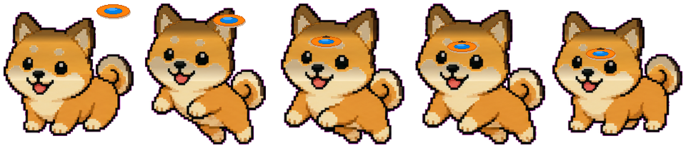

# Chatty Claude Pet

Customize your [OpenPets](https://github.com/anthropics/open-pets) desktop companion for Claude Code: make it talk automatically with zero token cost, and create custom pets that look like your actual dog (or cat, or whatever you want).

- [Automatic Speech](#automatic-speech): hook-driven speech bubbles, no AI tokens required
- [Custom Pet Sprites](#custom-pet-sprites): turn a photo of your pet into a working desktop companion

## Automatic Speech

<p align="center">
  
  
  
  
</p>

By default, the `@open-pets/claude-pets` hooks update the pet's animation state (thinking, editing, celebrating) but don't trigger speech bubbles. Speech only happens when the AI explicitly calls `openpets_say` via MCP, which costs tokens and depends on the model remembering to do it.

This project adds two shell scripts that send randomized speech bubbles directly over the OpenPets IPC socket, bypassing the MCP server entirely. The pet talks at key moments on its own, no AI involvement required.

## What it looks like

| Event | Animation | Speech |
|---|---|---|
| You submit a prompt | thinking | "On it!" / "Hold my coffee." / "Challenge accepted." |
| Claude runs a tool | editing/running | (animation only, no speech to avoid noise) |
| Claude needs permission | waiting | "Hey! I need your approval to continue." |
| Claude finishes | celebrating | "Nailed it." / "Chef's kiss." / "Mic drop." |
| Claude hits an error | error | "I blame the gremlins." / "Error 404: success not found." |

## Requirements

- macOS (uses Unix domain sockets and `nc -U`)
- [Claude Code](https://docs.anthropic.com/en/docs/claude-code) installed
- [Bun](https://bun.sh) installed
- [OpenPets](https://github.com/anthropics/open-pets) desktop app running

## Setup

### 1. Install the scripts

Copy the two scripts somewhere on your PATH:

```bash
cp openpets-say.sh openpets-notify.sh ~/bin/
chmod +x ~/bin/openpets-say.sh ~/bin/openpets-notify.sh
```

Or clone this repo and add it to your PATH:

```bash
git clone https://github.com/heathensxyz/chatty-claude-pet.git
export PATH="$HOME/chatty-claude-pet:$PATH"
```

### 2. Add the MCP server (if you haven't already)

```bash
claude mcp add openpets -- bunx --bun @open-pets/mcp
```

This lets Claude call `openpets_say` during sessions for contextual messages (separate from the automatic hook speech).

### 3. Configure hooks

Copy the example config into your Claude Code settings:

**For a specific project** (recommended to start):
```bash
mkdir -p .claude
cp example-settings.local.json .claude/settings.local.json
```

**For all projects** (global):
```bash
cp example-settings.local.json ~/.claude/settings.local.json
```

If you already have a `settings.local.json`, merge the `hooks` section into it.

### 4. Update script paths

If you didn't install the scripts to `~/bin/`, update the paths in your `settings.local.json` to point to wherever you put them.

### 5. Customize the messages

Edit the quoted strings in each hook command. The format is:

```
openpets-say.sh <state> "message 1" "message 2" "message 3" ...
```

The script picks one message at random each time. States control the pet's animation: `thinking`, `success`, `error`, `waiting`.

**Let Claude do it for you:** This repo includes a `CLAUDE.md` that teaches Claude Code how to personalize your pet's messages. If you clone this repo into a project directory (or copy `CLAUDE.md` into your project), just ask Claude to "personalize my pet's speech" and it will rewrite the message pools in your `settings.local.json` to match your personality.

## How it works

```
Claude Code event fires
        |
        v
claude-pets hook updates animation state
        |
        v
openpets-say.sh picks a random message
        |
        v
Sends JSON event over IPC socket (/tmp/openpets-{uid}/openpets.sock)
        |
        v
OpenPets app shows speech bubble
```

The IPC event format matches what `openpets_say` sends internally: `{state, source: "mcp", type: "mcp.say", message, timestamp}`. No changes to the OpenPets app or `claude-pets` package are needed.

## Design decisions

**Why not add speech to `claude-pets` directly?** Hooks and MCP speech are intentionally separate in OpenPets by design. This approach layers speech on top without modifying either package.

**Why shell scripts instead of a node package?** Minimal dependencies, easy to customize, trivial to debug. The scripts are 10 lines each.

**Why no speech on PreToolUse/Notification?** They fire too frequently. Having the pet talk every time Claude reads a file or runs a command gets noisy fast.

## Platform support

Currently macOS only. The scripts use Unix domain sockets (`/tmp/openpets-{uid}/openpets.sock`) and `nc -U`. Contributions for Linux and Windows (named pipes) are welcome.

---

## Custom Pet Sprites

You can replace the default pet with one that looks like your actual dog, cat, or whatever you want. This section covers the sprite sheet format and a Python-based recolor workflow that turns an existing pet into a custom one.

<p align="center">
  
  
</p>

### The Sprite Sheet Format

Every pet is two files in a folder:

```
my-pet/
  pet.json
  spritesheet.png   (or .webp)
```

**pet.json:**

```json
{
  "id": "my-pet",
  "displayName": "My Pet",
  "description": "A short description of your pet",
  "spritesheetPath": "spritesheet.png"
}
```

**Sprite sheet dimensions:** exactly **1536 x 1872 pixels**. The loader validates this strictly.

The sheet is an 8-column by 9-row grid, where each frame is **192 x 208 pixels**.

### Animation Rows

| Row | Animation | Frames | When It Plays |
|-----|-----------|--------|---------------|
| 0 | Idle | 6 | Default state, sleeping |
| 1 | Running Right | 8 | Directional movement |
| 2 | Running Left | 8 | Directional movement |
| 3 | Waving | 4 | Greeting |
| 4 | Jumping | 5 | Success, celebrating |
| 5 | Failed | 8 | Error, warning |
| 6 | Waiting | 6 | Testing, waiting |
| 7 | Running | 6 | Working, editing |
| 8 | Review | 6 | Thinking |

Claude Code triggers these automatically: thinking while reasoning, working while editing, celebrating on success, etc.

### Recoloring an Existing Pet

The fastest path to a custom pet. Pick an existing pet with the right body shape and remap its colors.

Installed pets live at `~/Library/Application Support/OpenPets/pets/`. Open the sprite sheets to find a good base (e.g., `shiba` for dogs).

#### 1. Identify Color Zones

```python
from PIL import Image
import numpy as np

img = Image.open("base-spritesheet.webp").convert("RGBA")
data = np.array(img, dtype=np.float64)
alpha = data[:,:,3]
mask = alpha > 128
r, g, b = data[:,:,0], data[:,:,1], data[:,:,2]

# Define zones by color range (adjust for your base pet)
is_body = mask & (r > 150) & (g > 100) & (g < 200) & (b < 120)
is_face = mask & (r > 220) & (g > 200) & (b > 150)
```

#### 2. Apply Position-Based Color Shifts

Flat color swaps look unnatural. Instead, vary color based on where each pixel sits within its frame, so you can add patterns like dark ears, a face mask, or a saddle.

```python
import math

frame_h, frame_w = 208, 192
out = data.copy()

for row in range(9):
    y_start = row * frame_h
    for col in range(8):
        x_start = col * frame_w
        frame_alpha = alpha[y_start:y_start+frame_h, x_start:x_start+frame_w]
        if not (frame_alpha > 128).any():
            continue

        # Find sprite bounds within the frame
        ys = np.where(frame_alpha > 128)[0]
        top_y, bot_y = ys.min(), ys.max()
        sprite_height = bot_y - top_y + 1

        for y in range(y_start, y_start + frame_h):
            for x in range(x_start, x_start + frame_w):
                # 0.0 = top of sprite, 1.0 = bottom
                rel_y = (y - y_start - top_y) / max(sprite_height, 1)

                if is_body[y, x]:
                    if rel_y < 0.20:
                        # Dark ears
                        s = 0.6
                        out[y,x,0] = data[y,x,0] * (1-s) + 60 * s
                        out[y,x,1] = data[y,x,1] * (1-s) + 40 * s
                        out[y,x,2] = data[y,x,2] * (1-s) + 22 * s
                    else:
                        # Warm fawn body
                        out[y,x,:3] = data[y,x,:3] * [0.96, 0.90, 0.88]
```

**Tip:** Use gaussian or cosine curves for transitions between color zones. Hard cutoffs look painted-on.

```python
# Gaussian falloff example
vert = math.exp(-((rel_y - 0.1) ** 2) / (2 * 0.08))
darken = 0.6 * vert
```

#### 3. Add Props to Specific Frames

You can draw directly onto animation frames. For example, adding a frisbee to the jumping row:

```python
from PIL import ImageDraw

result = Image.fromarray(np.clip(out, 0, 255).astype(np.uint8), 'RGBA')
draw = ImageDraw.Draw(result)

jump_y = 4 * frame_h  # row 4

for i, (fx, fy, fw, fh) in enumerate([
    (155, jump_y + 15, 46, 18),   # flying in
    (125, jump_y + 28, 44, 17),   # getting closer
    (72,  jump_y + 58, 42, 15),   # caught!
]):
    cx = i * frame_w + fx
    # Orange outer ring
    draw.ellipse([cx-fw//2, fy-fh//2, cx+fw//2, fy+fh//2],
                  fill=(255, 125, 0, 255))
    # Blue center
    iw, ih = int(fw * 0.55), int(fh * 0.5)
    draw.ellipse([cx-iw//2, fy-ih//2, cx+iw//2, fy+ih//2],
                  fill=(0, 130, 230, 255))
```

### Creating from Scratch

If you're drawing pixel art or using an AI image generator:

- Canvas: 1536 x 1872, transparent background
- Draw guides at every 192px horizontal, 208px vertical
- Center sprites within each cell
- Dark outlines help readability at small sizes on any wallpaper
- WebP preferred over PNG for file size (existing pets range 92KB to 2MB)

### Installing Your Custom Pet

Copy your pet folder into the pets directory:

```bash
cp -r my-pet ~/Library/Application\ Support/OpenPets/pets/my-pet-custom
```

Update the config to point to it:

```python
import json

config_path = f"{os.path.expanduser('~')}/Library/Application Support/OpenPets/config.json"
with open(config_path) as f:
    config = json.load(f)
config["petPath"] = f"{os.path.expanduser('~')}/Library/Application Support/OpenPets/pets/my-pet-custom"
with open(config_path, "w") as f:
    json.dump(config, f, indent=2)
```

Restart OpenPets to load the new pet.

To iterate, overwrite the sprite sheet in place and restart:

```bash
cp updated-spritesheet.png ~/Library/Application\ Support/OpenPets/pets/my-pet-custom/spritesheet.png
```

### Testing Animations

Trigger specific states over the IPC socket:

```bash
echo '{"state":"celebrating","source":"test","type":"test"}' | \
  nc -U /tmp/openpets-$(id -u)/openpets.sock
```

States: `idle`, `thinking`, `working`, `editing`, `running`, `testing`, `waiting`, `waving`, `success`, `celebrating`, `error`, `warning`, `sleeping`.

### Example: Hendo

See [`examples/`](examples/) for a working custom pet built by recoloring the shiba sprite sheet to match a pair of Belgian Malinois. The result: dark ears, warm face mask, fawn body, dark tail tip, and a frisbee catch in the jumping animation.

<p align="center">
  
</p>

---

## Credits

Built on top of [OpenPets](https://github.com/anthropics/open-pets) and [`@open-pets/claude-pets`](https://www.npmjs.com/package/@open-pets/claude-pets) by the OpenPets team.
